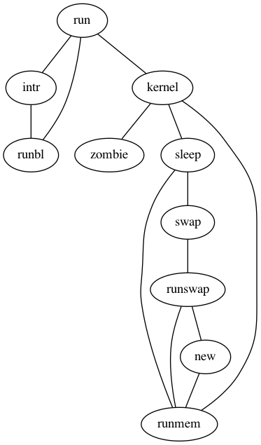

# Gallery

## Process

Example...

```ts
import { Graph, toDot } from 'ts-graphviz';

const g = new Graph('G');

g.edge(['run', 'intr']);
g.edge(['intr', 'runbl']);
g.edge(['runbl', 'run']);
g.edge(['run', 'kernel']);
g.edge(['kernel', 'zombie']);
g.edge(['kernel', 'sleep']);
g.edge(['kernel', 'runmem']);
g.edge(['sleep', 'swap']);
g.edge(['swap', 'runswap']);
g.edge(['runswap', 'new']);
g.edge(['runswap', 'runmem']);
g.edge(['new', 'runmem']);
g.edge(['sleep', 'runmem']);

toDot(g);
```



[more...](gallery/process/README.md)

## test

Example...

```ts
import { toDot, digraph } from 'ts-graphviz';

const G = digraph('G');

toDot(G);
```


[more...](gallery/test/README.md)

## Contributing

```bash
# Create new script
$ yarn new <your-script-name>
# Build Gallary
$ yarn build
```
