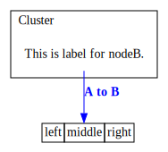

<!-- THIS FILE IS GENERATED BY scripts/build.ts, DON'T EDIT -->
# Gallery

## Process

This graph was created from a hand-made figure in an operating system paper.

```ts
import { Graph, toDot } from 'ts-graphviz';

const g = new Graph('G');

g.set('layout', 'neato');
g.edge(['run', 'intr']);
g.edge(['intr', 'runbl']);
g.edge(['runbl', 'run']);
g.edge(['run', 'kernel']);
g.edge(['kernel', ['zombie', 'sleep', 'runmem']]);
g.edge(['sleep', 'swap']);
g.edge(['swap', 'runswap']);
g.edge(['runswap', 'new']);
g.edge(['runswap', 'runmem']);
g.edge(['new', 'runmem']);
g.edge(['sleep', 'runmem']);

toDot(g);
```


[more...](gallery/process/README.md)

## JSX

In this example, [@ts-graphviz/react](https://github.com/ts-graphviz/react) is used to describe the DOT language in JSX.

```tsx
import { Digraph, Node, Subgraph, Edge, DOT, renderToDot } from '@ts-graphviz/react';

const Example = () => (
  <Digraph
    rankdir="TB"
    edge={{
      color: 'blue',
      fontcolor: 'blue',
    }}
    node={{
      shape: 'none',
    }}
  >
    <Node
      id="nodeA"
      shape="none"
      label={
        <DOT.TABLE BORDER="0" CELLBORDER="1" CELLSPACING="0">
          <DOT.TR>
            <DOT.TD>left</DOT.TD>
            <DOT.TD PORT="m">middle</DOT.TD>
            <DOT.TD PORT="r">right</DOT.TD>
          </DOT.TR>
        </DOT.TABLE>
      }
    />

    <Subgraph id="cluster" label="Cluster" labeljust="l">
      <Node id="nodeB" label="This is label for nodeB." />
    </Subgraph>
    <Edge targets={['nodeB', 'nodeA:m']} comment="Edge from node A to B" label={<DOT.B>A to B</DOT.B>} />
  </Digraph>
);

renderToDot(<Example />);
```



[more...](gallery/jsx/README.md)

## Clusters

This small example illustrates dot's feature to draw nodes and edges in clusters or separate rectangular layout regions.
Clusters are encoded as subgraphs whose names have the prefix `cluster`.
The color attribute of a cluster is interpreted as its outline color or its background color if its style is `filled`.
Mdiamond and Msquare are modified symbols for data flow diagrams.

```ts
import { toDot, digraph, attribute } from 'ts-graphviz';

const G = digraph('G', (g) => {
  g.subgraph('cluster_0', (s) => {
    s.set(attribute.label, 'process #1');
    s.set(attribute.color, 'lightgrey');
    s.set(attribute.style, 'filled');
    s.node({
      [attribute.style]: 'filled',
      [attribute.color]: 'white',
    });

    s.edge(['a0', 'a1', 'a2', 'a3']);
  });

  g.subgraph('cluster_1', (s) => {
    s.set(attribute.label, 'process #2');
    s.set(attribute.color, 'blue');
    s.node({
      [attribute.style]: 'filled',
    });

    s.edge(['b0', 'b1', 'b2', 'b3']);
  });

  g.edge(['start', ['a0', 'b0']]);
  g.edge(['a1', 'b3']);
  g.edge(['b2', 'a3']);
  g.edge(['a3', 'a0']);
  g.edge([['a3', 'b3'], 'end']);
});

toDot(G);
```


[more...](gallery/clusters/README.md)

## Contributing

```bash
# Create new script
$ yarn new <your-script-name>
# Build Gallary
$ yarn build
```

## License

This software is released under the MIT License, see [LICENSE](./LICENSE).
