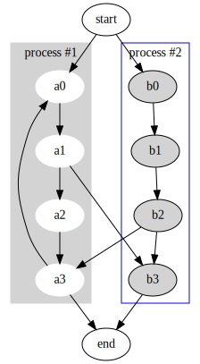

<!-- THIS FILE IS GENERATED BY scripts/build.ts, DON'T EDIT -->
# Clusters

This small example illustrates dot's feature to draw nodes and edges in clusters or separate rectangular layout regions.
Clusters are encoded as subgraphs whose names have the prefix `cluster`.
The color attribute of a cluster is interpreted as its outline color or its background color if its style is `filled`.
Mdiamond and Msquare are modified symbols for data flow diagrams.

## Code

```ts
import { toDot, digraph, attribute } from 'ts-graphviz';

const G = digraph('G', (g) => {
  g.subgraph('cluster_0', (s) => {
    s.set(attribute.label, 'process #1');
    s.set(attribute.color, 'lightgrey');
    s.set(attribute.style, 'filled');
    s.node({
      [attribute.style]: 'filled',
      [attribute.color]: 'white',
    });

    s.edge(['a0', 'a1', 'a2', 'a3']);
  });

  g.subgraph('cluster_1', (s) => {
    s.set(attribute.label, 'process #2');
    s.set(attribute.color, 'blue');
    s.node({
      [attribute.style]: 'filled',
    });

    s.edge(['b0', 'b1', 'b2', 'b3']);
  });

  g.edge(['start', ['a0', 'b0']]);
  g.edge(['a1', 'b3']);
  g.edge(['b2', 'a3']);
  g.edge(['a3', 'a0']);
  g.edge([['a3', 'b3'], 'end']);
});

toDot(G);
```

## Result



