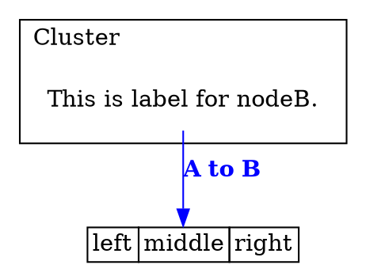
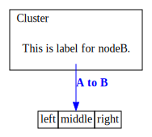

<!-- THIS FILE IS GENERATED BY scripts/build.ts, DON'T EDIT -->
# JSX

Example...

## Code

```tsx
import { Digraph, Node, Subgraph, Edge, DOT, renderToDot } from '@ts-graphviz/react';

const Example = () => (
  <Digraph
    rankdir="TB"
    edge={{
      color: 'blue',
      fontcolor: 'blue',
    }}
    node={{
      shape: 'none',
    }}
  >
    <Node
      id="nodeA"
      shape="none"
      label={
        <DOT.TABLE BORDER="0" CELLBORDER="1" CELLSPACING="0">
          <DOT.TR>
            <DOT.TD>left</DOT.TD>
            <DOT.TD PORT="m">middle</DOT.TD>
            <DOT.TD PORT="r">right</DOT.TD>
          </DOT.TR>
        </DOT.TABLE>
      }
    />

    <Subgraph id="cluster" label="Cluster" labeljust="l">
      <Node id="nodeB" label="This is label for nodeB." />
    </Subgraph>
    <Edge targets={['nodeB', 'nodeA:m']} comment="Edge from node A to B" label={<DOT.B>A to B</DOT.B>} />
  </Digraph>
);

renderToDot(<Example />);
```

## Result




