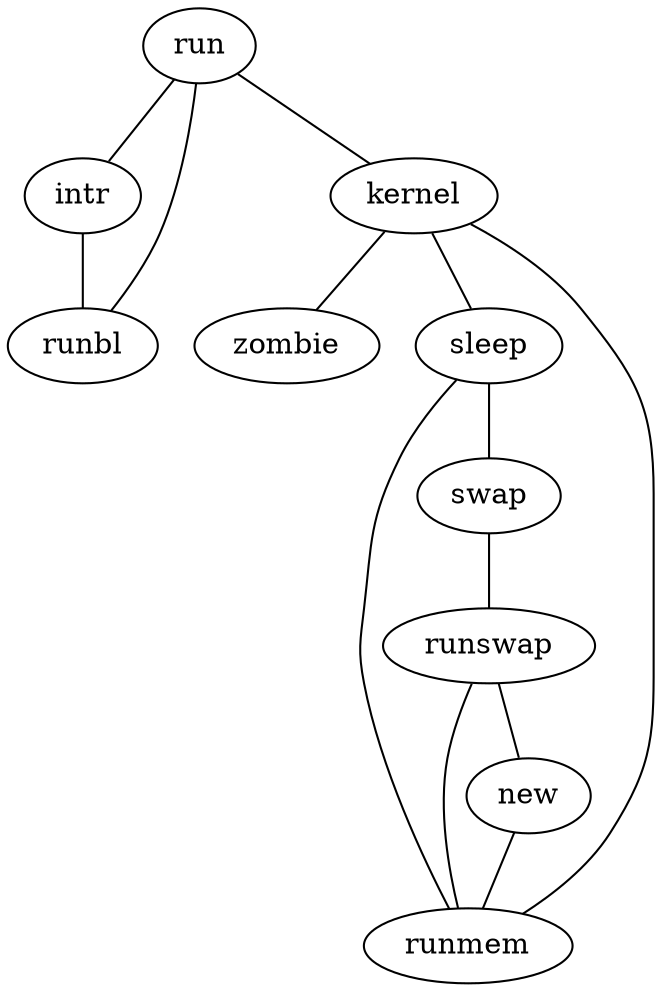

<!-- THIS FILE IS GENERATED BY scripts/build.ts, DON'T EDIT -->
# Process

Example...

## Code

```ts
import { Graph, toDot } from 'ts-graphviz';

const g = new Graph('G');

g.edge(['run', 'intr']);
g.edge(['intr', 'runbl']);
g.edge(['runbl', 'run']);
g.edge(['run', 'kernel']);
g.edge(['kernel', ['zombie', 'sleep', 'runmem']]);
g.edge(['sleep', 'swap']);
g.edge(['swap', 'runswap']);
g.edge(['runswap', 'new']);
g.edge(['runswap', 'runmem']);
g.edge(['new', 'runmem']);
g.edge(['sleep', 'runmem']);

toDot(g);
```

## Result




